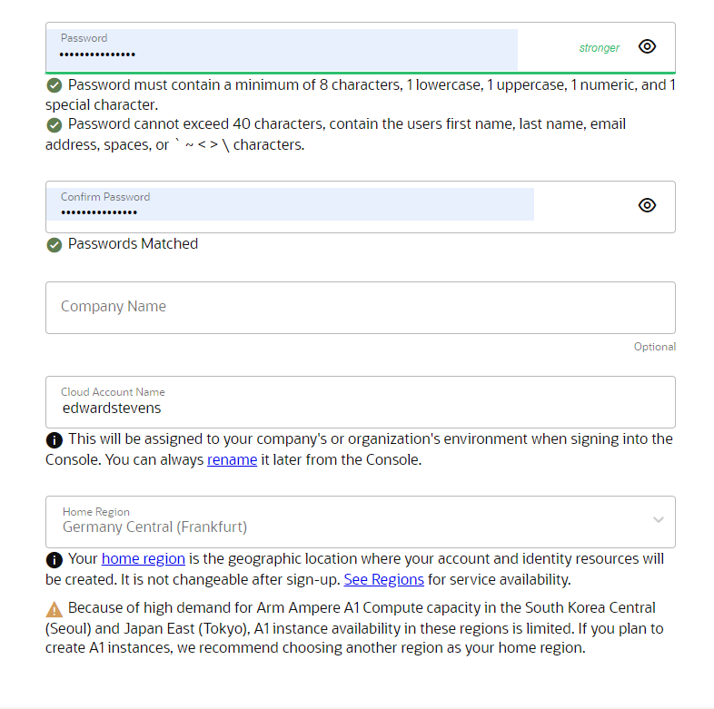

##  Steps for creating a free RabbitMQ instance on Oracle Cloud
1. ### Register an Oracle Cloud Free Tier account.
    ###### *** You may skip this step if you already have an account.

    Go to ```https://signup.cloud.oracle.com``` to create a free account.


 


After verifying your email, you will be asked to fill out your password,
cloud account name, home region and optionally your company's name.

Cloud account name and region are very important, the latter will decide
where will be the location of the servers that we use and can NOT be changed later!

For our example, we will choose Frankfurt.


    

Next, we will be asked to fill in our address information, here we should use real
information as it will be matched to the debit/credit card that we will use to verify our account.

After filling in our address information, we will be asked to add a payment verification method
if it was filled correctly, it will charge $1 or it's equivalent which will be promptly returned
shortly after our identity was verified.


Now, all we have to do is click below on the `Start my free trial` button and our account is ready to use!


2. ### Create a VM instance.

After registration, we will be redirected to ```https://cloud.oracle.com/?region=eu-frankfurt-1```, 
here we need to select the `Create a VM instance` button.


Now we need to configure our VM: 

- Placement:  Make sure to select `AD 3` domain


- Image and shape: We are going to use `Oracle Linux 8` for this example,
for the shape select `VM.Standard.E2.1.Micro`, which is always free.


- Networking: Create a new cloud network and leave the default settings, make sure `Assign a public IPv4 address` is checked.


- Add SSH keys: You have various options here, we will go with pasting an SSH keys, 
it is recommended to add or generate one at this step for easy access to your VM.


- Boot volume: Leave the default settings here.


Now, your VM is configured and it is reated to be created, click the `CREATE` button below.


2. ### Install docker to your VM.

Now that our VM is created, we will be brought to its dashboard where we can see its current status,
various control buttons such as `START` or `STOP`, but what we are looking for now is its public IP and the username so that we can SSH to it.


2.1. Now, we can connect to our VM using the details from the dashboard 
and the following command: 

      ssh opc@129.233.145.112

2.2. Run the system update command to rebuild the repo cache and update installed packages.

      sudo yum update

2.3. To add a repository without going through the repo file and edit to insert a repository URL, we can use the yum-config-manager tool:

      sudo yum install -y yum-utils

2.4. Now, let's enable Oracle Linux 8 addons using:

      sudo yum-config-manager --enable ol8_addons


2.5. Now that our VM is configured, let's install docker!
Our first step will be adding the Docker Repository to Oracle Linux,
as Oracle is just like CentOS, thus we can use the CentOS repository officially available for users by Docker developers.
And here is the command to add the same on Oracle Linux 8:

      sudo yum-config-manager --add-repo https://download.docker.com/linux/centos/docker-ce.repo

2.6. To install Docker Engine, command line and contained (a standalone high-level container runtime) run, finally, this command:

      sudo yum install docker-ce docker-ce-cli containerd.io

This should be the output:


Great! Now we have Docker installed on our VM.


3. ### Networking configuration, user access and start-up.

3.1. Don't start Docker up just yet, first, let's configure our Vm to allow access through our required ports.
To do that, we need to edit the Ingress Rules of our VM.

Head back to ```https://cloud.oracle.com/``` and click on the ```Menu```:


Select ```Networking``` from the list that opens up:


Select ```Virtual Cloud Networks``` from ```Networking```:


First, select your compartment from the left side and then click on your VCN (VCN will appear after select a comportment):


From the VCN dashboard, on the left side select ```Security lists``` and select the default security list or create one if it doesn't exist:


Now click on ```Add Ingress Rules``` and complete it the following way:


Now that we opened up the ports to our VM, let's head back to SSH.

3.2. User access.

By default, docker needs the root access to run commands,
thus without using ```sudo```, you will get an error.
Therefore, we add our current or the user that you want to use to access docker to the docker group.

      sudo groupadd docker

      sudo service docker restart

      sudo usermod -aG docker your_user

In our case, ```your_user``` will be ```opc```.
Now, you can use the docker commands without sudo!

3.3. Start-up.

Finally, we can start docker services, to do this run the following commands:

      sudo systemctl start docker

      sudo systemctl enable docker

And test if it's running with:

      docker run hello-world


4. ### Create and run RabbitMQ in a Docker container.

   Let's make sure we are in the home directory ```/home/opc```using:


      pwd


   Create a new directory named ```rabbitmq``` and open it:

      mkdir rabbitmq
         
      cd rabbitmq

   Create a new file named ```enabled_plugins```:

      nano enabled_plugins

   And write this into the file (don't forget the dot at the end):

       [rabbitmq_management,rabbitmq_mqtt].

   Make sure the docker container will be able to read this file with:

         sudo chmod 777 enabled_plugins

         
   Now, we are ready to create and start our container with RabbitMQ!
   To do this, run the following command:

      docker run -d \
      --restart always \
      --hostname rabbitmq-vm-instance \
      -p 80:15672 -p 1883:1883 -p 443:15671 -p 5672:5672 \
      -e RABBITMQ_DEFAULT_USER=username \
      -e RABBITMQ_DEFAULT_PASS=p4ssw0rd \
      -v /home/opc/rabbitmq/enabled_plugins:/etc/rabbitmq/enabled_plugins \
      -v /home/opc/rabbitmq/:/var/lib/rabbitmq \
      --name rabbitmq \
      rabbitmq:3-management

   Make sure to change hostname, username and password accordingly.

   Now our container is starting up, check its status with:

         docker logs rabbitmq

   And if you see this, that means it's running!


   You can use the public IP to visit the RabbitMQ control panel, no port is required since we made an ingress rule for port :80.


